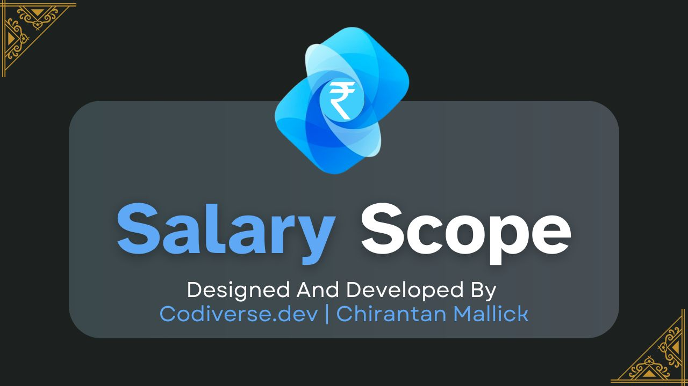

<!-- Banner Image -->
<p align="center">
  
</p>

<h1 align="center" style="color:#2546ff;font-size:2.8rem;font-weight:800;letter-spacing:2px;">Salary Scope: A Data Scientist Salary Predictor</h1>

<p align="center" style="color:#5fa8f6;font-size:1.2rem;font-weight:500;">
  <strong>Predict your salary with confidence using AI-powered insights.</strong>
</p>

---

## <span style="color:#2546ff;">✨ Features</span>
- <span style="color:#5fa8f6;">Accurate Predictions:</span> Utilizes a Gradient Boosting Regressor model with <strong style="color:#2546ff;">R² = 0.89 (89%)</strong> accuracy.
- <span style="color:#5fa8f6;">Interactive Web Interface:</span> User-friendly form to input your details and get instant salary predictions.
- <span style="color:#5fa8f6;">Data-Driven Insights:</span> Helps professionals and employers understand salary benchmarks in the industry.
- <span style="color:#5fa8f6;">Easy Deployment:</span> Optimized for Render cloud platform.

---

## <span style="color:#2546ff;">🛠️ Tech Stack & Tools</span>
- <span style="color:#5fa8f6;">Backend:</span> Python, Flask
- <span style="color:#5fa8f6;">Machine Learning:</span> scikit-learn, pandas, numpy
- <span style="color:#5fa8f6;">Model:</span> Gradient Boosting Regressor
- <span style="color:#5fa8f6;">Deployment:</span> Render (Gunicorn)

---

## <span style="color:#2546ff;">🚀 Getting Started (Local Development)</span>

```sh
# 1. Clone the repository
   git clone <your-repo-url>
   cd Salary-scope

# 2. Create a virtual environment
   python -m venv venv
   venv\Scripts\activate  # On Windows
   # or
   source venv/bin/activate  # On macOS/Linux

# 3. Install dependencies
   pip install -r requirements.txt

# 4. Train the model (if needed)
   python train_model.py

# 5. Run the app locally
   python app.py
```
The app will be available at [http://localhost:5000](http://localhost:5000)

---

## <span style="color:#2546ff;">☁️ Deploying on Render</span>

1. <span style="color:#5fa8f6;">Push your code to GitHub.</span>
2. <span style="color:#5fa8f6;">Create a new Web Service on <a href="https://render.com/" style="color:#2546ff;">Render</a>:</span>
   - Connect your GitHub repo.
   - Render will auto-detect your Python app.
   - Make sure you have a <code>Procfile</code> with:
     ```
     web: gunicorn app:app
     ```
   - All required files (<code>model.joblib</code>, <code>requirements.txt</code>, etc.) should be in the repo.
3. <span style="color:#5fa8f6;">Deploy!</span>
   - Render will build and start your app.
   - Visit your Render URL to use Salary Scope.

---

## <span style="color:#2546ff;">📈 Model Performance</span>

- <span style="color:#5fa8f6;">Model:</span> Gradient Boosting Regressor
- <span style="color:#5fa8f6;font-weight:bold;">Accuracy Score (R²):</span> <strong style="color:#2546ff;font-size:1.3em;">89%</strong>

---

## <span style="color:#2546ff;">📁 Project Structure</span>

```text
Salary-scope/
  app.py
  train_model.py
  requirements.txt
  Procfile
  model.joblib
  static/
  templates/
  README.md
```

---

## <span style="color:#2546ff;">🤝 Contributing</span>

Contributions are welcome! Please fork the repo and submit a pull request.

---

## <span style="color:#2546ff;">📄 License</span>

Distributed under the MIT License.
